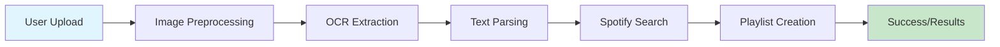

<div align="center">

 
# Spotify Playlist Extractor

### Extract songs from screenshots and create Spotify playlists automatically

[](https://opensource.org/licenses/MIT)
[](https://www.python.org/downloads/)
[](https://flask.palletsprojects.com/)
[](https://spotipy.readthedocs.io/)

[Features](#-features) • [Demo](#-demo) • [Installation](#-installation) • [Usage](#-usage) • [API](#-api-reference) • [Contributing](#-contributing)

</div>

---

## 📖 Table of Contents

- [Overview](#-overview)
- [Features](#-features)
- [Demo](#-demo)
- [Architecture](#-architecture)
- [Installation](#-installation)
- [Configuration](#-configuration)
- [Usage](#-usage)
- [API Reference](#-api-reference)
- [Project Structure](#-project-structure)
- [Technologies Used](#-technologies-used)
- [Troubleshooting](#-troubleshooting)
- [Contributing](#-contributing)
- [Roadmap](#-roadmap)
- [License](#-license)
- [Acknowledgments](#-acknowledgments)
- [Contact](#-contact)

---

## 🌟 Overview

**Spotify Playlist Extractor** is a powerful Flask web application that leverages Optical Character Recognition (OCR) to extract song titles and artist names from screenshots of Spotify playlists. It automatically searches for these songs on Spotify and creates a playlist for you—no manual typing required!

Now featuring a **stunning dark mode UI** inspired by Spotify's own design, making the experience seamless and beautiful.

Perfect for:
- 📱 Transferring playlists from screenshots
- 🎧 Recreating playlists shared as images
- 🔄 Backing up playlists from inaccessible accounts
- 📊 Converting playlist recommendations from social media

---

## ✨ Features

<table>
<tr>
<td>

### 🖼️ Smart OCR Processing
- Multi-method text extraction
- Advanced image preprocessing
- Mobile & desktop UI recognition
- Noise reduction & enhancement

</td>
<td>

### 🎯 Intelligent Matching
- Multiple search strategies
- Fuzzy matching algorithm
- Artist name validation
- Regional content support

</td>
</tr>
<tr>
<td>

### 🎨 Modern UI/UX
- **New!** Spotify-inspired Dark Mode
- Glassmorphism effects
- Drag & Drop file upload
- Responsive design for mobile & desktop

</td>
<td>

### 🎶 Spotify Integration
- OAuth 2.0 authentication
- Auto playlist creation
- Manual search fallback
- 30-second previews

</td>
</tr>
</table>

---

## 🏗️ Architecture



### Workflow

1. **Image Upload**: User uploads screenshots (PNG, JPG, JPEG)
2. **Preprocessing**: Images are enhanced for better OCR accuracy
3. **Text Extraction**: Tesseract OCR extracts text using multiple methods
4. **Smart Parsing**: Algorithm identifies song-artist pairs
5. **Spotify Matching**: Searches Spotify with multiple strategies
6. **Playlist Creation**: Generates a new playlist with matched songs

---

## 🚀 Installation

### Prerequisites

Before you begin, ensure you have the following installed:

- **Python 3.7+** - [Download Python](https://www.python.org/downloads/)
- **Tesseract OCR** - Required for text extraction
- **Spotify Account** - Free or Premium
- **ngrok** (for development) - [Download ngrok](https://ngrok.com/download)

### Step 1: Install Tesseract OCR

<details>
<summary><b>Windows</b></summary>

1. Download the installer from [GitHub](https://github.com/UB-Mannheim/tesseract/wiki)
2. Run the installer (default path: `C:\Program Files\Tesseract-OCR`)
3. Add Tesseract to your PATH or update the path in `.env`

</details>

<details>
<summary><b>macOS</b></summary>

```bash
brew install tesseract
```

</details>

<details>
<summary><b>Linux (Ubuntu/Debian)</b></summary>

```bash
sudo apt-get update
sudo apt-get install tesseract-ocr
```

</details>

### Step 2: Clone the Repository

```bash
git clone https://github.com/CODEMASTERSTACK/Spotify-Extractor.git
cd spotify-playlist-extractor
```

### Step 3: Create Virtual Environment

```bash
# Create virtual environment
python -m venv venv

# Activate virtual environment
# Windows
venv\Scripts\activate
# macOS/Linux
source venv/bin/activate
```

### Step 4: Install Dependencies

```bash
pip install -r requirements.txt
```

**requirements.txt:**
```txt
Flask>=2.0.0
Pillow>=9.0.0
pytesseract>=0.3.10
spotipy>=2.23.0
python-dotenv>=0.19.0
```

---

## ⚙️ Configuration

### 1. Create Spotify App

1. Go to [Spotify Developer Dashboard](https://developer.spotify.com/dashboard)
2. Click **"Create App"**
3. Fill in the details:
   - **App Name**: Your app name
   - **App Description**: Brief description
   - **Redirect URI**: `http://localhost:5000/callback` (or your ngrok URL)
4. Accept terms and click **"Create"**
5. Note your **Client ID** and **Client Secret**

### 2. Set Up Environment Variables

Create a `.env` file in the project root (you can copy `.env.example` if available):

```env
# Spotify Configuration
SPOTIPY_CLIENT_ID=your_client_id_here
SPOTIPY_CLIENT_SECRET=your_client_secret_here
SPOTIPY_REDIRECT_URI=http://localhost:5000/callback

# Flask Configuration
FLASK_SECRET_KEY=generate_a_strong_random_key_here

# Optional: Tesseract Path (if not in PATH)
# TESSERACT_CMD=C:\Program Files\Tesseract-OCR\tesseract.exe
```

### 3. Set Up ngrok (Optional for Dev)

If you want to test with a public URL:

```bash
ngrok http 5000
```
Update `SPOTIPY_REDIRECT_URI` in your `.env` with the ngrok URL.

---

## 💻 Usage

### Starting the Application

```bash
# Activate virtual environment
source venv/bin/activate  # macOS/Linux
venv\Scripts\activate     # Windows

# Run the application
python app.py
```

The application will be available at `http://localhost:5000`

### Step-by-Step Guide

#### 1️⃣ **Login with Spotify**

- Open `http://localhost:5000` in your browser
- Click **"Login with Spotify"**
- Authorize the application

#### 2️⃣ **Upload Screenshots**

- Drag and drop your screenshots into the upload zone
- Select up to 10 images (PNG, JPG, JPEG)
- Click **"Extract Songs"**

**Tips for Best Results:**
- Use high-resolution screenshots
- Ensure text is clearly visible
- Avoid excessive UI elements in frame
- Crop to playlist area if possible

#### 3️⃣ **Review Detected Songs**

- View all extracted songs with album artwork
- Check the **"Not Found"** section for unmatched songs
- Use manual search for missing tracks

#### 4️⃣ **Create Playlist**

- Click **"Add All to Playlist"** to create a new playlist
- Or add songs individually with **"Add"** button
- Preview songs with the play button (if available)

#### 5️⃣ **Find Your Playlist**

- Open Spotify (mobile or desktop)
- Go to **"Your Library"**
- Find playlist named **"Extracted Playlist [RANDOM]"**

---

## 📚 API Reference

### Endpoints

#### `POST /`
**Upload and process images**

**Request:**
- Method: `POST`
- Content-Type: `multipart/form-data`
- Body: `images` (file array, max 10 files)

#### `GET /login`
**Initiate Spotify OAuth flow**

#### `GET /callback`
**Spotify OAuth callback**

#### `POST /add_song`
**Add individual song to playlist**

**Request:**
```json
{
  "track_uri": "spotify:track:xxx"
}
```

#### `POST /add_all`
**Add all songs to playlist**

#### `POST /search_songs`
**Manual search for songs**

**Request:**
```json
{
  "query": "search term"
}
```

---

## 📁 Project Structure

```
spotify-playlist-extractor/
│
├── 📄 app.py                    # Main Flask application
├── 📄 requirements.txt          # Python dependencies
├── 📄 .env                      # Environment variables (create this!)
├── 📄 .gitignore               # Git ignore rules
├── 📄 README.md                # This file
│
├── 📁 templates/
│   ├── 📄 upload.html          # Upload page (Drag & Drop)
│   └── 📄 songs.html           # Songs review page
│
├── 📁 static/
│   ├── 📁 css/
│   │   └── 📄 style.css        # New Dark Theme Styles
│   └── 📁 images/
│
└── 📁 uploads/                  # Temporary upload directory
```

---

## 🛠️ Technologies Used

### Backend
- **Flask** - Web framework
- **Pytesseract** - OCR wrapper for Tesseract
- **Pillow (PIL)** - Image processing
- **Spotipy** - Spotify API wrapper
- **Python-Dotenv** - Configuration management

### Frontend
- **HTML5/CSS3** - Modern semantic markup
- **Glassmorphism** - Premium UI design
- **JavaScript** - Interactive elements

### OCR & Image Processing
- **Tesseract OCR** - Text recognition engine
- **PIL ImageEnhance** - Contrast & sharpness enhancement

---

## 🐛 Troubleshooting

### Common Issues

<details>
<summary><b>❌ Tesseract not found error</b></summary>

**Error:** `pytesseract.pytesseract.TesseractNotFoundError`

**Solution:**
1. Verify Tesseract is installed: `tesseract --version`
2. Update `TESSERACT_CMD` in your `.env` file:
   ```env
   TESSERACT_CMD=C:\Program Files\Tesseract-OCR\tesseract.exe
   ```

</details>

<details>
<summary><b>❌ Spotify authentication fails</b></summary>

**Error:** `Invalid redirect URI` or `Invalid client`

**Solution:**
1. Verify Client ID and Secret in `.env`
2. Check redirect URI matches exactly in Spotify Dashboard
3. Ensure ngrok is running and URL is up-to-date (if using ngrok)

</details>

---

## 🤝 Contributing

Contributions are welcome! Please follow these guidelines:

1. **Fork the repository**
2. **Create a feature branch**
3. **Commit your changes**
4. **Push to the branch**
5. **Open a Pull Request**

---

## 🗺️ Roadmap

### Version 1.1 (Planned)
- [ ] Support for Apple Music screenshots
- [ ] Playlist editing features
- [ ] Export to CSV/JSON

### Version 2.0 (Future)
- [ ] Desktop application (Electron)
- [ ] Mobile app (React Native)
- [ ] Collaborative playlist creation

### Completed
- [x] Multiple image upload
- [x] Advanced OCR processing
- [x] Spotify integration
- [x] Dark mode theme (UI Overhaul)
- [x] Environment variable configuration

---

## 📄 License

This project is licensed under the MIT License - see the [LICENSE](LICENSE) file for details.

---

## 🙏 Acknowledgments

- **[Tesseract OCR](https://github.com/tesseract-ocr/tesseract)** - Open source OCR engine
- **[Spotipy](https://spotipy.readthedocs.io/)** - Lightweight Python library for Spotify Web API
- **[Flask](https://flask.palletsprojects.com/)** - Micro web framework

---

## 📞 Contact

**Kripal Singh**
- GitHub: [@CODEMASTERSTACK](https://github.com/CODEMASTERSTACK)
- Email: leosen.krish@gmail.com

**Project Link:** [https://github.com/CODEMASTERSTACK/spotify-Extractor](https://github.com/CODEMASTERSTACK/Spotify-Extractor)

---

<div align="center">

### ⭐ Star this repo if you find it helpful!

Made with ❤️ and 🎵

[Back to Top](#-spotify-Extractor)

</div>
