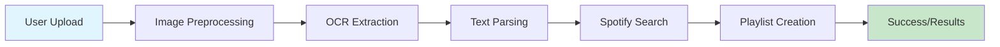

<div align="center">

# 🎵 Spotify Playlist Extractor

### Extract songs from screenshots and create Spotify playlists automatically

[](https://opensource.org/licenses/MIT)
[](https://www.python.org/downloads/)
[](https://flask.palletsprojects.com/)
[](https://spotipy.readthedocs.io/)

[Features](#-features) • [Demo](#-demo) • [Installation](#-installation) • [Usage](#-usage) • [API](#-api-reference) • [Contributing](#-contributing)

</div>

---

## 📖 Table of Contents

- [Overview](#-overview)
- [Features](#-features)
- [Demo](#-demo)
- [Architecture](#-architecture)
- [Installation](#-installation)
- [Configuration](#-configuration)
- [Usage](#-usage)
- [API Reference](#-api-reference)
- [Project Structure](#-project-structure)
- [Technologies Used](#-technologies-used)
- [Troubleshooting](#-troubleshooting)
- [Contributing](#-contributing)
- [Roadmap](#-roadmap)
- [License](#-license)
- [Acknowledgments](#-acknowledgments)
- [Contact](#-contact)

---

## 🌟 Overview

**Spotify Playlist Extractor** is a powerful Flask web application that leverages Optical Character Recognition (OCR) to extract song titles and artist names from screenshots of Spotify playlists. It automatically searches for these songs on Spotify and creates a playlist for you—no manual typing required!

Perfect for:
- 📱 Transferring playlists from screenshots
- 🎧 Recreating playlists shared as images
- 🔄 Backing up playlists from inaccessible accounts
- 📊 Converting playlist recommendations from social media

---

## ✨ Features

<table>
<tr>
<td>

### 🖼️ Smart OCR Processing
- Multi-method text extraction
- Advanced image preprocessing
- Mobile & desktop UI recognition
- Noise reduction & enhancement

</td>
<td>

### 🎯 Intelligent Matching
- Multiple search strategies
- Fuzzy matching algorithm
- Artist name validation
- Regional content support

</td>
</tr>
<tr>
<td>

### 📤 Batch Processing
- Upload up to 10 screenshots
- Duplicate detection
- Progress tracking
- Error handling

</td>
<td>

### 🎶 Spotify Integration
- OAuth 2.0 authentication
- Auto playlist creation
- Manual search fallback
- 30-second previews

</td>
</tr>
</table>

---

## 🎬 Demo

### Upload Screenshots


### Review Detected Songs


### Create Your Playlist


> **Note**: Replace placeholder images with actual screenshots of your application

---

## 🏗️ Architecture



### Workflow

1. **Image Upload**: User uploads screenshots (PNG, JPG, JPEG)
2. **Preprocessing**: Images are enhanced for better OCR accuracy
3. **Text Extraction**: Tesseract OCR extracts text using multiple methods
4. **Smart Parsing**: Algorithm identifies song-artist pairs
5. **Spotify Matching**: Searches Spotify with multiple strategies
6. **Playlist Creation**: Generates a new playlist with matched songs

---

## 🚀 Installation

### Prerequisites

Before you begin, ensure you have the following installed:

- **Python 3.7+** - [Download Python](https://www.python.org/downloads/)
- **Tesseract OCR** - Required for text extraction
- **Spotify Account** - Free or Premium
- **ngrok** (for development) - [Download ngrok](https://ngrok.com/download)

### Step 1: Install Tesseract OCR

<details>
<summary><b>Windows</b></summary>

1. Download the installer from [GitHub](https://github.com/UB-Mannheim/tesseract/wiki)
2. Run the installer (default path: `C:\Program Files\Tesseract-OCR`)
3. Add Tesseract to your PATH or update the path in `app.py`

</details>

<details>
<summary><b>macOS</b></summary>

```bash
brew install tesseract
```

</details>

<details>
<summary><b>Linux (Ubuntu/Debian)</b></summary>

```bash
sudo apt-get update
sudo apt-get install tesseract-ocr
```

</details>

### Step 2: Clone the Repository

```bash
git clone https://github.com/yourusername/spotify-playlist-extractor.git
cd spotify-playlist-extractor
```

### Step 3: Create Virtual Environment

```bash
# Create virtual environment
python -m venv venv

# Activate virtual environment
# Windows
venv\Scripts\activate
# macOS/Linux
source venv/bin/activate
```

### Step 4: Install Dependencies

```bash
pip install -r requirements.txt
```

**requirements.txt:**
```txt
Flask>=2.0.0
Pillow>=9.0.0
pytesseract>=0.3.10
spotipy>=2.23.0
```

---

## ⚙️ Configuration

### 1. Create Spotify App

1. Go to [Spotify Developer Dashboard](https://developer.spotify.com/dashboard)
2. Click **"Create App"**
3. Fill in the details:
   - **App Name**: Your app name
   - **App Description**: Brief description
   - **Redirect URI**: `http://localhost:5000/callback` (or your ngrok URL)
4. Accept terms and click **"Create"**
5. Note your **Client ID** and **Client Secret**

### 2. Set Up ngrok (Development)

```bash
# Start ngrok tunnel
ngrok http 5000

# Copy the HTTPS URL (e.g., https://abcd1234.ngrok.io)
```

### 3. Configure Application

Create a `.env` file in the project root:

```env
SPOTIPY_CLIENT_ID=your_client_id_here
SPOTIPY_CLIENT_SECRET=your_client_secret_here
SPOTIPY_REDIRECT_URI=https://your-ngrok-url.ngrok.io/callback
FLASK_SECRET_KEY=your_secure_random_key
```

Update `app.py` to use environment variables:

```python
import os
from dotenv import load_dotenv

load_dotenv()

SPOTIPY_CLIENT_ID = os.getenv('SPOTIPY_CLIENT_ID')
SPOTIPY_CLIENT_SECRET = os.getenv('SPOTIPY_CLIENT_SECRET')
SPOTIPY_REDIRECT_URI = os.getenv('SPOTIPY_REDIRECT_URI')
app.secret_key = os.getenv('FLASK_SECRET_KEY')
```

**Add to requirements.txt:**
```txt
python-dotenv>=0.19.0
```

### 4. Update Tesseract Path (Windows Only)

If Tesseract is not in your PATH, update the path in `app.py`:

```python
# Windows
pytesseract.pytesseract.tesseract_cmd = r'C:\Program Files\Tesseract-OCR\tesseract.exe'

# macOS/Linux (usually auto-detected)
# No change needed
```

---

## 💻 Usage

### Starting the Application

```bash
# Activate virtual environment
source venv/bin/activate  # macOS/Linux
venv\Scripts\activate     # Windows

# Run the application
python app.py
```

The application will be available at `http://localhost:5000`

### Step-by-Step Guide

#### 1️⃣ **Login with Spotify**

- Open `http://localhost:5000` in your browser
- Click **"Login with Spotify"**
- Authorize the application

#### 2️⃣ **Upload Screenshots**

- Click **"Choose Files"** or drag and drop
- Select up to 10 images (PNG, JPG, JPEG)
- Click **"Upload and Extract"**

**Tips for Best Results:**
- Use high-resolution screenshots
- Ensure text is clearly visible
- Avoid excessive UI elements in frame
- Crop to playlist area if possible

#### 3️⃣ **Review Detected Songs**

- View all extracted songs with album artwork
- Check the **"Not Found"** section for unmatched songs
- Use manual search for missing tracks

#### 4️⃣ **Create Playlist**

- Click **"Add All to Playlist"** to create a new playlist
- Or add songs individually with **"Add to Playlist"**
- Preview songs with the play button (if available)

#### 5️⃣ **Find Your Playlist**

- Open Spotify (mobile or desktop)
- Go to **"Your Library"**
- Find playlist named **"Extracted Playlist [RANDOM]"**

---

## 📚 API Reference

### Endpoints

#### `POST /`
**Upload and process images**

**Request:**
- Method: `POST`
- Content-Type: `multipart/form-data`
- Body: `images` (file array, max 10 files)

**Response:**
```json
{
  "songs": [
    {
      "uri": "spotify:track:xxx",
      "name": "Song Name",
      "artist": "Artist Name",
      "image": "https://...",
      "id": "track_id",
      "preview_url": "https://..."
    }
  ],
  "not_found": [
    ["Song Name", "Artist Name"]
  ],
  "total_extracted": 15
}
```

#### `GET /login`
**Initiate Spotify OAuth flow**

**Response:** Redirects to Spotify authorization page

#### `GET /callback`
**Spotify OAuth callback**

**Query Parameters:**
- `code`: Authorization code from Spotify

**Response:** Redirects to home page with authenticated session

#### `POST /add_song`
**Add individual song to playlist**

**Request:**
```json
{
  "track_uri": "spotify:track:xxx",
  "track_name": "Song Name"
}
```

**Response:**
```json
{
  "success": true,
  "message": "Added Song Name to playlist"
}
```

#### `POST /add_all`
**Add all songs to playlist**

**Response:**
```json
{
  "success": true,
  "message": "Added 15 songs to playlist"
}
```

#### `POST /search_songs`
**Manual search for songs**

**Request:**
```json
{
  "query": "search term"
}
```

**Response:**
```json
{
  "success": true,
  "songs": [...]
}
```

---

## 📁 Project Structure

```
spotify-playlist-extractor/
│
├── 📄 app.py                    # Main Flask application
├── 📄 requirements.txt          # Python dependencies
├── 📄 .env.example             # Environment variables template
├── 📄 .gitignore               # Git ignore rules
├── 📄 README.md                # This file
│
├── 📁 templates/
│   ├── 📄 base.html            # Base template
│   ├── 📄 upload.html          # Upload page
│   └── 📄 songs.html           # Songs review page
│
├── 📁 static/
│   ├── 📁 css/
│   │   └── 📄 style.css        # Stylesheets
│   ├── 📁 js/
│   │   └── 📄 script.js        # JavaScript
│   └── 📁 images/
│       └── 📄 logo.png         # Assets
│
├── 📁 uploads/                  # Temporary upload directory
│
└── 📁 tests/                    # Unit tests
    ├── 📄 test_ocr.py
    └── 📄 test_spotify.py
```

---

## 🛠️ Technologies Used

### Backend
- **Flask** - Web framework
- **Pytesseract** - OCR wrapper for Tesseract
- **Pillow (PIL)** - Image processing
- **Spotipy** - Spotify API wrapper

### OCR & Image Processing
- **Tesseract OCR** - Text recognition engine
- **PIL ImageEnhance** - Contrast & sharpness enhancement
- **PIL ImageFilter** - Noise reduction

### Authentication
- **Spotify OAuth 2.0** - Secure user authentication
- **Flask Sessions** - Session management

### Tools & Services
- **ngrok** - Local tunnel for OAuth redirect
- **Spotify Web API** - Music data and playlist management

---

## 🐛 Troubleshooting

### Common Issues

<details>
<summary><b>❌ Tesseract not found error</b></summary>

**Error:** `pytesseract.pytesseract.TesseractNotFoundError`

**Solution:**
1. Verify Tesseract is installed: `tesseract --version`
2. Update the path in `app.py`:
   ```python
   pytesseract.pytesseract.tesseract_cmd = r'/path/to/tesseract'
   ```
3. Add Tesseract to system PATH

</details>

<details>
<summary><b>❌ Spotify authentication fails</b></summary>

**Error:** `Invalid redirect URI` or `Invalid client`

**Solution:**
1. Verify Client ID and Secret in `.env`
2. Check redirect URI matches exactly in Spotify Dashboard
3. Ensure ngrok is running and URL is up-to-date
4. Clear browser cookies and try again

</details>

<details>
<summary><b>❌ Songs not detected correctly</b></summary>

**Problem:** OCR extracts wrong or incomplete text

**Solution:**
1. Use higher resolution screenshots (1080p+)
2. Crop images to show only playlist area
3. Ensure good contrast and lighting
4. Try screenshots from desktop version (clearer text)
5. Manually search for missing songs

</details>

<details>
<summary><b>❌ Songs not found on Spotify</b></summary>

**Problem:** Valid songs show in "Not Found" section

**Solution:**
1. Check if song is available in your region
2. Try manual search with corrected spelling
3. Verify song exists on Spotify
4. Check for special characters in song name

</details>

<details>
<summary><b>❌ Upload fails or times out</b></summary>

**Problem:** Large images fail to upload

**Solution:**
1. Reduce image file size (compress or resize)
2. Upload fewer images at once (max 10)
3. Check internet connection
4. Increase Flask timeout in production

</details>

---

## 🤝 Contributing

Contributions are welcome! Please follow these guidelines:

### How to Contribute

1. **Fork the repository**
2. **Create a feature branch**
   ```bash
   git checkout -b feature/AmazingFeature
   ```
3. **Commit your changes**
   ```bash
   git commit -m 'Add some AmazingFeature'
   ```
4. **Push to the branch**
   ```bash
   git push origin feature/AmazingFeature
   ```
5. **Open a Pull Request**

### Development Setup

```bash
# Install development dependencies
pip install -r requirements-dev.txt

# Run tests
python -m pytest tests/

# Run linter
flake8 app.py

# Format code
black app.py
```

### Code Style

- Follow PEP 8 guidelines
- Add docstrings to functions
- Include type hints where applicable
- Write unit tests for new features

### Reporting Issues

Please use the [Issue Tracker](https://github.com/yourusername/spotify-playlist-extractor/issues) and include:
- Detailed description of the issue
- Steps to reproduce
- Expected vs actual behavior
- Screenshots if applicable
- System information (OS, Python version, etc.)

---

## 🗺️ Roadmap

### Version 1.1 (Planned)
- [ ] Support for Apple Music screenshots
- [ ] Dark mode theme
- [ ] Playlist editing features
- [ ] Export to CSV/JSON

### Version 2.0 (Future)
- [ ] Desktop application (Electron)
- [ ] Mobile app (React Native)
- [ ] Collaborative playlist creation
- [ ] AI-powered song recommendations
- [ ] Support for YouTube Music, Deezer

### Completed
- [x] Multiple image upload
- [x] Advanced OCR processing
- [x] Spotify integration
- [x] Manual search fallback

---

## 📄 License

This project is licensed under the MIT License - see the [LICENSE](LICENSE) file for details.

```
MIT License

Copyright (c) 2024 [Your Name]

Permission is hereby granted, free of charge, to any person obtaining a copy
of this software and associated documentation files (the "Software"), to deal
in the Software without restriction, including without limitation the rights
to use, copy, modify, merge, publish, distribute, sublicense, and/or sell
copies of the Software, and to permit persons to whom the Software is
furnished to do so, subject to the following conditions:

The above copyright notice and this permission notice shall be included in all
copies or substantial portions of the Software.

THE SOFTWARE IS PROVIDED "AS IS", WITHOUT WARRANTY OF ANY KIND, EXPRESS OR
IMPLIED, INCLUDING BUT NOT LIMITED TO THE WARRANTIES OF MERCHANTABILITY,
FITNESS FOR A PARTICULAR PURPOSE AND NONINFRINGEMENT. IN NO EVENT SHALL THE
AUTHORS OR COPYRIGHT HOLDERS BE LIABLE FOR ANY CLAIM, DAMAGES OR OTHER
LIABILITY, WHETHER IN AN ACTION OF CONTRACT, TORT OR OTHERWISE, ARISING FROM,
OUT OF OR IN CONNECTION WITH THE SOFTWARE OR THE USE OR OTHER DEALINGS IN THE
SOFTWARE.
```

---

## 🙏 Acknowledgments

- **[Tesseract OCR](https://github.com/tesseract-ocr/tesseract)** - Open source OCR engine
- **[Spotipy](https://spotipy.readthedocs.io/)** - Lightweight Python library for Spotify Web API
- **[Flask](https://flask.palletsprojects.com/)** - Micro web framework
- **[Pillow](https://python-pillow.org/)** - Python Imaging Library
- **[ngrok](https://ngrok.com/)** - Secure tunneling solution
- **Spotify** - For providing an amazing API
- **Contributors** - Thank you to all who have contributed!

---

## 📞 Contact

**Your Name**
- GitHub: [@yourusername](https://github.com/yourusername)
- Email: your.email@example.com
- Twitter: [@yourhandle](https://twitter.com/yourhandle)

**Project Link:** [https://github.com/yourusername/spotify-playlist-extractor](https://github.com/yourusername/spotify-playlist-extractor)

---

<div align="center">

### ⭐ Star this repo if you find it helpful!

Made with ❤️ and 🎵

[Back to Top](#-spotify-playlist-extractor)

</div>
